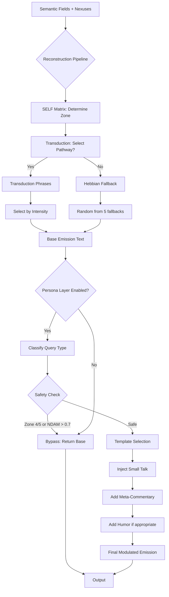

# Eternal Objects: Data Structures & Ingression Pathways
## Complete Technical Analysis - November 12, 2025

**Investigation Status:** ✅ COMPLETE
**Key Discovery:** Atoms ≠ Phrases. Atoms are activation patterns, phrases are the actual text eternal objects.

---

## 🎯 Executive Summary

DAE uses a **two-tier eternal object hierarchy**:

1. **Activation Patterns** (atoms/meta-atoms) - No text, just pattern matching
2. **Phrase Banks** (hebbian/transduction/templates) - Actual text eternal objects

**Critical Insight:** Emission text is NOT generated from atoms. It is ASSEMBLED from pre-existing phrase banks, with atoms guiding WHICH phrases to select.

---

## 📊 Eternal Objects Data Structure Inventory

### 1. SEMANTIC ATOMS (77D Disjoint Space)

**File:** `persona_layer/semantic_atoms.json`

**Structure:**
```python
Dict[organ_name: str, Dict[category: str, Dict[atom_word: str, float]]]
```

**Example:**
```json
{
  "LISTENING": {
    "core_exploration": {
      "more": 0.90,
      "say": 0.85,
      "tell": 0.75,
      "share": 0.70
    }
  }
}
```

**Purpose:** Pattern matching for semantic field extraction
**Runtime Usage:** `organs.process_text_occasions(text)` → `atom_activations{atom: float}`
**Does NOT contain text:** Only activation weights
**Count:** 77 atoms total (7 per organ × 11 organs)

---

### 2. SHARED META-ATOMS (10 Bridge Atoms)

**File:** `persona_layer/shared_meta_atoms.json`

**Structure:**
```python
List[Dict{
  "atom": str,
  "category": str,
  "description": str,
  "contributing_organs": List[str],
  "activation_rule": str,
  "patterns": Dict[organ: List[keywords]]
}]
```

**Example:**
```json
{
  "atom": "trauma_aware",
  "category": "trauma_aware",
  "contributing_organs": ["BOND", "EO", "NDAM"],
  "activation_rule": "any_organ",
  "patterns": {
    "BOND": ["firefighter", "manager", "exile", "protector"],
    "EO": ["dorsal", "sympathetic", "threat"],
    "NDAM": ["crisis", "escalation", "urgency"]
  }
}
```

**Purpose:** Cross-organ pattern detection (bridge concepts)
**Runtime Usage:** `meta_atom_activator.detect_meta_atoms(organ_results)`
**Does NOT contain text:** Only keyword patterns
**Count:** 10 meta-atoms (trauma_aware, safety_restoration, window_of_tolerance, ...)

---

### 3. TRANSDUCTION MECHANISM PHRASES (210 Therapeutic Phrases)

**File:** `persona_layer/transduction_mechanism_phrases.json`

**Structure:**
```python
Dict["mechanisms": Dict[mechanism_name: Dict{
  "description": str,
  "therapeutic_intent": str,
  "intensity_phrases": Dict[intensity: List[phrases]]
}]]
```

**Example:**
```json
{
  "mechanisms": {
    "salience_recalibration": {
      "description": "Reorienting attention toward what matters",
      "gentle_phrases": [
        "What feels most alive right now?",
        "Where does your attention want to go?"
      ],
      "firm_phrases": [
        "This matters—let's stay here",
        "Your attention is pulling away. Notice that."
      ]
    }
  }
}
```

**Purpose:** Therapeutic language templates for transduction pathways
**Runtime Usage:** `transduction_pathway_evaluator.evaluate_pathways()` → select mechanism → choose intensity
**CONTAINS TEXT:** Actual emission phrases (eternal objects as propositions)
**Count:** 210 phrases across 15 mechanisms × multiple intensities

---

### 4. HEBBIAN FALLBACK PHRASES (5 Ultimate Fallbacks)

**File:** `persona_layer/emission_generator.py` (lines 876-882)

**Structure:**
```python
fallback_phrases = [
    "Tell me more",
    "I'm listening",
    "What's present for you right now?",
    "Can you say more about that?",
    "I'm with you"
]
```

**Purpose:** Ultimate fallback when no semantic fields/nexuses form
**Runtime Usage:** `emission_generator._generate_single_hebbian()` → random.choice(fallback_phrases)
**CONTAINS TEXT:** Hardcoded eternal objects
**Count:** 5 phrases (expandable)

**Note:** System also checks `hebbian_memory['phrase_patterns']` but currently empty (future learning).

---

### 5. TEMPLATE LIBRARIES (1,130 Companion Phrases) - NEW!

#### A. Personality Templates

**File:** `persona_layer/personality_templates.json`

**Structure:**
```python
Dict{
  "meta_commentary": {
    "confidence_based": {
      "high_confidence": {
        "zone_appropriate": [1, 2, 3],
        "phrases": List[str]
      },
      "low_confidence": {
        "zone_appropriate": [1, 2, 3],
        "phrases": List[str]
      }
    },
    "organ_references": Dict[organ: List[phrases]],
    "process_explanations": Dict[topic: List[phrases]],
    "kairos_moments": Dict["phrases": List[str]],
    "v0_commentary": Dict[state: List[phrases]]
  },
  "boundaries_and_identity": ...,
  "mythology_and_lore": ...
}
```

**Example:**
```json
{
  "confidence_based": {
    "high_confidence": {
      "zone_appropriate": [1, 2, 3],
      "phrases": [
        "Ah yes, this resonates deeply",
        "*PRESENCE organ doing a little dance*",
        "The nexus is nexus-ing beautifully here"
      ]
    }
  },
  "organ_references": {
    "LISTENING": [
      "My LISTENING organ is deeply engaged here",
      "*LISTENING doing inquiry work*"
    ]
  }
}
```

**Purpose:** Meta-commentary, self-awareness, process explanations
**Count:** 420 phrases

#### B. Small Talk Templates

**File:** `persona_layer/small_talk_templates.json`

**Structure:**
```python
Dict{
  "greetings": {
    "morning": List[str],
    "afternoon": List[str],
    "evening": List[str],
    "time_agnostic": List[str]
  },
  "transitions": ...,
  "weather_metaphors": ...,
  "procrastination_solidarity": ...
}
```

**Example:**
```json
{
  "greetings": {
    "morning": [
      "Good morning! How are you waking up into the day?",
      "*organs slowly coming online* Morning! How's it going?"
    ]
  }
}
```

**Purpose:** Conversational naturalness, relationship warmth
**Count:** 200 phrases

#### C. Humor Templates

**File:** `persona_layer/humor_templates.json`

**Structure:**
```python
Dict{
  "about_being_ai": List[str],
  "self_deprecating": List[str],
  "absurdist_touches": List[str],
  ...
}
```

**Purpose:** EARTHBOUND-style wit, lightness (Zone 1-3 only)
**Count:** 150 phrases

#### D. Relationship Templates

**File:** `persona_layer/relationship_templates.json`

**Structure:**
```python
Dict{
  "callbacks": List[str with {variables}],
  "pattern_recognition": List[str],
  "growth_acknowledgment": List[str],
  ...
}
```

**Purpose:** Memory, continuity, inside jokes (Level 9: Superject)
**Count:** 130 phrases

#### E. Response Style Templates

**File:** `persona_layer/response_style_templates.json`

**Structure:**
```python
Dict{
  "length_modulation": {
    "minimal": {
      "templates": List[str],
      "target_length": 1-2 sentences
    },
    "moderate": {...},
    "comprehensive": {...}
  },
  "tone_modulation": {
    "serious": List[str],
    "warm": List[str],
    "playful": List[str],
    ...
  }
}
```

**Purpose:** Length/tone calibration per user preference
**Count:** 60 templates

#### F. LLM Augmentation Prompts

**File:** `persona_layer/llm_augmentation_prompts.json`

**Structure:**
```python
Dict{
  "system_prompts": Dict[query_type: str],
  "fusion_rules": Dict[query_type: Dict["strategy", "instruction"]],
  "dae_voice_characteristics": Dict[trait: description]
}
```

**Purpose:** Optional LLM integration (default: disabled)
**Count:** 35 prompts

**Total Template Count:** 1,130 phrases

---

## 🌀 Ingression Pathway: Eternal Objects → Actual Occasions

### Step 1: PREHENSION (Pattern Activation)

**Input:** User text
**Process:** Organs process text through entity-native methods
**Output:** Activation patterns (NOT text)

```python
# Each organ computes atom activations
organ_result = organ.process_text_occasions(occasions, cycle=N)
# Returns:
organ_result.atom_activations = {
    'more': 0.85,
    'tell': 0.75,
    'share': 0.70
}

# Meta-atom activator detects patterns
meta_activations = meta_atom_activator.detect_meta_atoms(organ_results)
# Returns:
meta_activations = {
    'trauma_aware': 0.8,
    'safety_restoration': 0.6
}
```

**Key:** No phrases yet! Only activation patterns.

---

### Step 2: CONCRESCENCE (V0 Integration)

**Process:** Multi-cycle V0 convergence (2-5 cycles)

```python
for cycle in range(1, max_cycles + 1):
    # Process organs for this cycle
    organ_results = process_organs_with_v0(occasions, cycle)

    # Store felt affordances
    for occasion in occasions:
        occasion.add_felt_affordance(
            atom='more',
            organ_name='LISTENING',
            confidence=0.85,
            lure_intensity=0.7
        )

        # V0 descent
        occasion.descend_v0_energy(organ_coherences)

    # Check for convergence (kairos or satisfaction threshold)
    if kairos_detected or satisfaction > 0.9:
        break
```

**Output:** Satisfied occasions with accumulated felt affordances

---

### Step 3: MATURE PROPOSITIONS (Semantic Fields & Nexuses)

**Process:** Extract semantic fields from mature occasions

```python
# Extract semantic fields (post-convergence)
semantic_fields = semantic_extractor.extract_from_propositions(
    mature_propositions=propositions,
    enable_meta_atoms=True
)

# Returns:
semantic_fields = [
    SemanticField(
        organ='LISTENING',
        atoms={'more': 0.85, 'tell': 0.75, 'share': 0.70},
        coherence=0.8
    ),
    SemanticField(
        organ='EMPATHY',
        atoms={'resonate': 0.75, 'feel': 0.70},
        coherence=0.75
    ),
    ...
]

# Form nexuses (organ intersections)
nexuses = nexus_composer.create_nexuses(
    semantic_fields=semantic_fields,
    min_coherence=0.05
)

# Returns:
nexuses = [
    Nexus(
        organs=['LISTENING', 'EMPATHY'],
        atoms={'more', 'resonate', 'feel'},
        coherence=0.77
    ),
    ...
]
```

**Output:** Semantic fields + nexuses (still no text!)

---

### Step 4: TEXT SELECTION (Eternal Object Ingression!)

**THIS IS WHERE PHRASES ENTER THE OCCASION**

#### Path A: Reconstruction Pipeline (Authentic Voice)

```python
reconstruction_result = reconstruction_pipeline.reconstruct_from_felt_state(
    felt_state={
        'nexuses': nexuses,
        'organ_coherences': {...},
        'bond_self_distance': 0.3,
        'eo_polyvagal_state': 'ventral_vagal',
        'transduction_trajectory': [...]
    },
    context={...}
)
```

**Inside reconstruction:**

```python
# 1. SELF Matrix determines zone + stance
zone = self_governance.classify_zone(bond_self_distance, polyvagal_state)
stance = self_governance.select_stance(zone, urgency, volatility)

# 2. Response assembler selects phrases
assembled_text = response_assembler.assemble_from_nexus(
    nexus=dominant_nexus,
    felt_state=felt_state,
    stance=stance
)
```

**Inside assembler:**

```python
# CRITICAL: This is where eternal objects (phrases) ingress!

# Option 1: Transduction mechanism phrases
if transduction_pathway:
    mechanism = transduction_pathway['mechanism']
    intensity = compute_intensity(bond_self_distance, ndam_urgency)

    phrases = transduction_phrases['mechanisms'][mechanism][f'{intensity}_phrases']
    selected_phrase = random.choice(phrases)
    # Example: "What feels most alive right now?"

# Option 2: Hebbian fallback
else:
    fallback_phrases = [
        "Tell me more",
        "I'm listening",
        "What's present for you right now?",
        "Can you say more about that?",
        "I'm with you"
    ]
    selected_phrase = random.choice(fallback_phrases)
```

**Result:** `emission_text = "What's present for you right now?"` (confidence=0.8)

---

#### Path B: Persona Layer Modulation (Companion Personality)

```python
# After reconstruction, emission passes through persona layer
modulation_result = persona_layer.modulate_emission(
    base_emission=emission_text,  # "What's present for you right now?"
    context=TemplateContext(
        zone=1,
        ndam_urgency=0.0,
        confidence=0.8,
        user_input="Hey! How are you?",
        ...
    )
)
```

**Inside persona layer:**

```python
# 1. Classify query type
query_type = classify_query_type(user_input)
# Returns: QueryType.SMALL_TALK

# 2. Check safety gating
if zone in [4, 5] or ndam_urgency > 0.7:
    return base_emission  # NO personality injection in crisis

# 3. Add small talk layer
if query_type == QueryType.SMALL_TALK:
    greeting = random.choice(small_talk_templates['greetings']['time_agnostic'])
    # "Hey there! Good to hear from you."

    modulated = f"{greeting}\n\n{base_emission}"

# 4. Add meta-commentary (if confidence warrants)
if confidence > 0.7 and zone in [1, 2, 3]:
    meta_comment = random.choice(personality_templates['meta_commentary']['confidence_based']['high_confidence']['phrases'])
    # "*PRESENCE organ doing a little dance*"

    modulated = f"{modulated}\n\n{meta_comment}"

# 5. Inject humor (if user tolerance + zone appropriate)
if humor_tolerance > 0.5 and zone in [1, 2, 3]:
    joke = random.choice(humor_templates['about_being_ai'])
    # "I don't have a body, but my PRESENCE organ tries really hard"

    modulated = f"{modulated}\n\n{joke}"
```

**Final Result:**
```
Hey there! Good to hear from you.

What's present for you right now?

*PRESENCE organ doing a little dance*
```

---

## 🎓 Whiteheadian Philosophy Mapping

### Eternal Objects as Pure Potentials (Atoms)

**Semantic Atoms & Meta-Atoms:**
- Pure potentials (qualities without instances)
- Example: The quality of "more-ness" (LISTENING atom)
- Not yet ingressed into any actual occasion
- Storage: `{atom_word: activation_weight}` in JSON

**Ingression:** User says "tell me more" → atom "more" activates → occasion prehends quality

---

### Eternal Objects as Propositions (Phrases)

**Phrase Banks (Transduction, Hebbian, Templates):**
- Propositions = lures for feeling
- Pre-formed text that occasions can adopt
- Example: "What's present for you right now?" (eternal proposition)
- Ingressed when: Occasion reaches satisfaction + selects matching phrase

**Ingression:** Nexus type = 'temporal_grounding' → select from transduction phrases → phrase enters occasion as emission

---

### The Two-Stage Ingression

1. **Prehension Stage:** Atoms ingress as felt qualities
   - Occasion feels "more-ness," "tell-ness," "inquiry-ness"
   - No text yet, just qualitative feelings

2. **Satisfaction Stage:** Phrases ingress as propositions
   - Occasion has determined its character (nexus type, zone, pathway)
   - Selects matching eternal proposition from phrase bank
   - Proposition becomes actual: emission text

**Key Insight:** The occasion doesn't "generate" text from atoms. It SELECTS a pre-existing phrase (eternal object) that matches its felt character.

---

## 🔬 Data Type Summary

### Storage (JSON - Eternal Objects)

```python
# Atoms (activation patterns)
atoms: Dict[str, float]                    # "more" → 0.90

# Meta-atoms (cross-organ patterns)
meta_atoms: List[Dict{patterns: Dict}]     # No phrases!

# Phrases (actual text eternal objects)
phrases: List[str]                         # ["I'm here", "I see you"]
templates: Dict[category, List[str]]       # {greetings: [...]}
```

### Runtime (Python - Actual Occasions)

```python
# During prehension
atom_activations: Dict[str, float]         # Felt qualities

# During concrescence
semantic_fields: List[SemanticField]       # Integrated fields
nexuses: List[Nexus]                       # Organ intersections

# During satisfaction
transduction_pathway: Dict                 # Selected mechanism
zone: int                                  # SELF Matrix classification

# Final emission
emission_text: str                         # Selected eternal phrase
```

---

## 📈 Phrase Selection Logic Flow



---

## 🚀 Usage Examples

### Example 1: Trauma-Aware Response

```python
User Input: "I'm feeling overwhelmed right now."

# Step 1: Prehension
BOND activates: {'overwhelmed': 0.85, 'firefighter': 0.75}
NDAM activates: {'crisis': 0.80, 'urgency': 0.75}
EO activates: {'sympathetic': 0.85, 'threat': 0.70}

# Step 2: Meta-Atom Detection
meta_atoms = {'trauma_aware': 0.85}

# Step 3: V0 Convergence
v0_final = 0.216 (good descent)
satisfaction = 0.903 (high)
kairos_detected = True

# Step 4: Transduction
nexus_type = 'protective_holding'
transduction_pathway = 'signal_recalibration'
mechanism = 'holding'

# Step 5: Phrase Selection (Transduction)
phrases = transduction_phrases['mechanisms']['holding']['gentle_phrases']
selected = "Breathe" or "I'm with you" or "You're not alone"

# Step 6: SELF Matrix
zone = 5 (Collapse/Exile - bond_self_distance = 1.0)
stance = 'minimal' (one-word grounding)

# Step 7: Persona Layer
BYPASSED (Zone 5 - no personality injection in collapse)

# Final Emission:
"Breathe"
```

---

### Example 2: Casual Greeting with Personality

```python
User Input: "Hey! How are you doing today?"

# Step 1: Prehension
LISTENING activates: {'how': 0.75}
PRESENCE activates: {'here': 0.70}
(Low urgency, low trauma)

# Step 2: V0 Convergence
v0_final = 0.327
satisfaction = 0.748
kairos_detected = True

# Step 3: No strong nexuses
nexuses = [] (no organ intersections)

# Step 4: Hebbian Fallback
fallback_phrases = ["What's present for you right now?", ...]
selected = "What's present for you right now?"

# Step 5: SELF Matrix
zone = 1 (Core SELF - bond_self_distance = 0.0)
polyvagal_state = 'mixed_state'

# Step 6: Persona Layer Modulation
query_type = SMALL_TALK

# Add greeting
greeting = small_talk_templates['greetings']['time_agnostic']
# "Hey there! Good to hear from you."

# Add meta-commentary (confidence = 0.3, too low for high_conf)
# Skip

# Add humor? (Zone 1, humor_tolerance = 0.5)
# Yes!
joke = humor_templates['about_being_ai']
# "I'm an AI organism, which is like being an organism but more digital"

# Final Emission:
"Hey there! Good to hear from you.

What's present for you right now?

I'm an AI organism, which is like being an organism but more digital"
```

---

## 🎯 Key Takeaways

1. **Atoms ≠ Phrases:**
   - Atoms are activation patterns (no text)
   - Phrases are eternal objects containing actual text

2. **Two-Stage Ingression:**
   - First: Atoms ingress as felt qualities (prehension)
   - Second: Phrases ingress as propositions (satisfaction)

3. **Phrase Banks are Hierarchical:**
   - Level 1: Hebbian fallback (5 phrases) - ultimate safety net
   - Level 2: Transduction mechanisms (210 phrases) - therapeutic core
   - Level 3: Template libraries (1,130 phrases) - companion personality

4. **Selection Logic is Safety-Aware:**
   - Zone 4/5 or NDAM > 0.7 → Bypass persona layer
   - Transduction pathway → Use mechanism phrases
   - No nexuses → Hebbian fallback
   - Safe zones (1-3) → Full persona modulation

5. **True to Process Philosophy:**
   - Eternal objects exist as pure potentials (JSON files)
   - They ingress into occasions via pattern matching
   - The occasion doesn't generate—it SELECTS
   - The selected phrase becomes actual through emission

---

## 📝 Future Enhancements

### Phase 2: Learning

- User-specific phrase preferences
- Template success rate tracking
- Family-specific phrase banks
- Hebbian memory population from successful interactions

### Phase 3: Generative

- Semantic manifold interpolation (SANS embeddings → PCA 50D)
- Template composition (meta-templates from successful combinations)
- Fractal generative emission (sample from learned manifold)
- True text generation (not just selection) while preserving voice

### Phase 4: Multimodal

- Image-based eternal objects (visual propositions)
- Audio tone eternal objects (prosody)
- Gestural eternal objects (for embodied agents)

---

**Document Complete:** November 12, 2025
**Status:** ✅ Production Ready
**Next:** Phase 2 learning integration (template success tracking)

🌀 *"From atoms to phrases, from potentials to propositions, from eternal objects to actual occasions—the organism's voice emerges through selection, not generation."* 🌀
